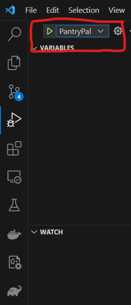

# This Recipe Application is a Recipe Generator called Pantry Pal.
Authors: Alexander Lee, FangZhong Li, Ryan Pacquia, Bryant Tan, Christopherian Sulaiman 

## This Application using Open AI's API's including ChatGPT, Whisper,and DALL-E. It also is built upon in an Agile Environment consisting of 5 team members listed above.
### Currently it only supports a web-application, but the code-based is built on the premise of expanding to Web and Mobile Applications through the MVC Design Pattern. 
### This applications incorporates many different Design Patterns including Strategy, Observer, and Builder Patterns.

How to run Pantry Pal Application:

1. Must have VSCode Downloaded and Java Extension Pack
2. Clone the Github repo if not already done and open the repo 
3. Go to the .vscode folder and open the 'launch.json' file
4. Go to line 13 where it says vmArgs and change the <AddFilePathOfProjectHere> to the Path of your project (For windows you can do this by opening the javafx folder and right clicking the lib folder and Pressing 'Copy Path' and pasting that at the <AddFilePathOfProjectHere>) 
5. Go to "Run and Debug" tab in the Side Bar of your VSCode: 

6. Run the Server by picking Server option in the dropdown tab (which is next to the green arrow in the top left) and click the run icon. If successfully done, the console will display "Server started on port 8100"

7. Run the Pantry pal 2 application by picking Pantry pal option in the dropdown tab and click the run icon. If successfully done, the application will launch.
8. In this stage, you are prompted to log in. Create an account if you haven't and log in if you haven't.
9. When you are logged-in you are able to see "Create new recipe", "Filter by", "Sort A-Z", "Sort Z-A", "Sort by latest", "Sort by earliest" and "Log out" button. Once your account has saved
   recipes, you are able to filter recipes according to the meal type and sort recipes according to alphabetical and chronological order.
10. When you click on the "Create new recipe" button, you are prompted to a new page with a "start recording" and "stop recording" button. 
   To create a new recipe, click on the recording button and answer the desired meal type prompt. Then click on stop recording. Do the same thing with the desired ingredients prompt.
   If done correctly, you will be brought into a new page where the application will generate a recipe according to your desired meal type and ingredients.
11. In the new page, you are able to regenerate the recipe if you are not satisfied by clicking the "regenerate recipe". You are also able to edit the instructions and ingredients of the recipe
   by clicking the edit button. Next to that, you are also able to save and cancel the recipe generated.

